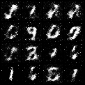
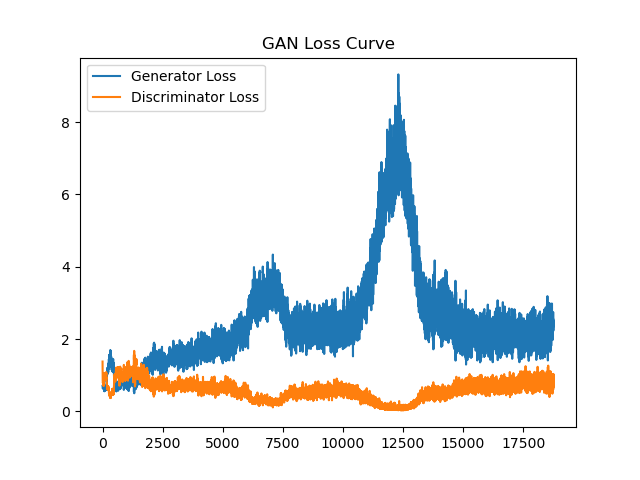

# Mini GAN on MNIST Digits 🎨

A simple implementation of Generative Adversarial Networks (GANs) on the MNIST dataset using PyTorch.

## 🔧 Features
- Generator & Discriminator in PyTorch
- Binary Cross Entropy Loss
- Trains on MNIST digits
- Saves generated images every epoch
- Loss curves and model checkpoints

## 🖼 Sample Output


## 📉 Loss Graph


## 🚀 How to Run

```bash
pip install -r requirements.txt
python train.py
